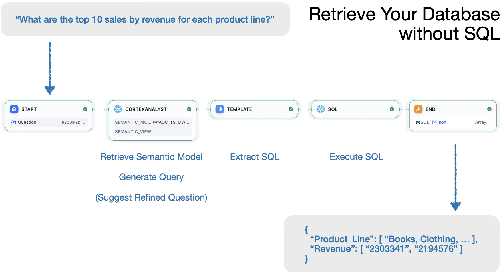
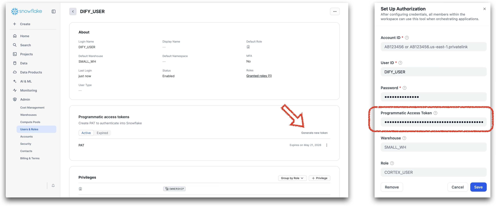
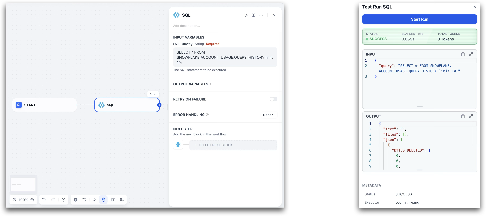
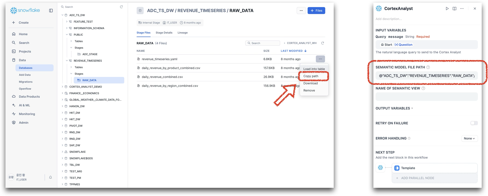

## Snowflake

**Author:** hankookncompany
**Version:** 0.0.1
**Type:** tool

**Github Repository**: https://github.com/hankookncompany/snowflake

### Overview

**Snowflake for Dify** is a plugin for Dify enables AI agents and workflows interact with data warehouse.
It handles both generation and execution of SQL statements, via Snowflake's Cortex Analyst engine.



### Configuration

1. **Prerequisite**

    This plugin supports the following two types of authentication method for Snowflake. Since the query generation cannot be performed with password authentication, we recommend creating a dedicated programmatic user on Snowflake, and providing both password and access token.
    - Password Auth : `sql`
    - Programmatic Access Token(PAT) : `sql`, `cortex_analyst` 

2. **Get Snowflake tools from Dify Plugin Marketplace**

    The Snowflake plugin could be found at Dify Plugin Marketplace, please be patient while Dify Plugin Daemon preparing environment and installing requirements.

3. **Fill Credentials for Snowflake**

    On the Dify, go to `Tools > Snowflake > Authentication` to fill the credentials.

    | **Field**   | **Description**                                                                 | **Required** |
    |-------------|----------------------------------------------------------------------------------|--------------|
    | `account`   | Your Snowflake account identifier <br> (e.g. `AB123456` or `AB123456.us-east-1.privatelink`) | ✅           |
    | `user`      | Your Snowflake user ID                                                          | ✅           |
    | `password`  | Your Snowflake password                                                         | ✅           |
    | `pat`       | Programmatic access token                     | ❌           |
    | `warehouse` | Snowflake warehouse to use (e.g. `SMALL_WH`)                                    | ❌           |
    | `role`      | Role to assume when connecting (e.g. `CORTEX_USER`)                              | ❌           |




### Usage

#### Execute SQL Statements

Simply put your SQL statements into `sql` block. The response will be a json with columnar structure.



``` SQL
/* input */
SELECT * FROM my_db.my_schema.my_table LIMIT 5;
```
``` json
/* response */
{
    "COLUMN_A" : [
        "1",
        "2",
        "3",
        "4",
        "5",
    ],
    "COLUMN_B" : [
        ...
    ],
    ...
}
```

#### Generate SQL Statements

[Snowflake Cortex Analyst](https://docs.snowflake.com/en/user-guide/snowflake-cortex/cortex-analyst) is a powerful assistant to retrieve data from database with natural language. This plugin provide a tool that enables using Cortex Analyst in your Dify workflows and agents.

To use Cortex Analyst, a detailed description for data, [Semantic Model](https://docs.snowflake.com/en/user-guide/snowflake-cortex/cortex-analyst/semantic-model-spec) and [Semantic View](https://docs.snowflake.com/en/user-guide/views-semantic/overview), should be pre-defined. Please reffer to the [related quickstart](https://quickstarts.snowflake.com/guide/getting_started_with_cortex_analyst/index.html?index=..%2F..index#0) from Snowflake.

Once your first semantic model has been built, browse into the stage, and click dropdown menu right on your semantic model, and then click `copy path`. The path should be in the format such as `@my_db.my_schema.my_stage/my_model.yaml`. Paste it into Cortex Analyst block.




``` text
/* question */
What are the top 10 sales by revenue for each product line?
```

``` json
/* response */
[
    {
      "message": {
        "content": [
          {
            "text": "This is our interpretation of your question:\n\nWhat are the top 10 sales by revenue for each product line over the entire available time period?",
            "type": "text"
          },
          {
            "confidence": {
              "verified_query_used": null
            },
            "statement": "WITH __daily_revenue_by_product_line AS (\n  SELECT\n    product_line,\n    date,\n    revenue AS daily_revenue_per_product_line\n  FROM my_db.revenue_timeseries.daily_revenue_by_product\n), product_line_revenue AS (\n  SELECT\n    product_line,\n    date,\n    SUM(daily_revenue_per_product_line) AS total_revenue\n  FROM __daily_revenue_by_product_line\n  GROUP BY\n    product_line,\n    date\n), ranked_revenue AS (\n  SELECT\n    product_line,\n    date,\n    total_revenue,\n    RANK() OVER (PARTITION BY product_line ORDER BY total_revenue DESC NULLS LAST) AS rnk\n  FROM product_line_revenue\n)\nSELECT\n  product_line,\n  date,\n  total_revenue\nFROM ranked_revenue\nWHERE\n  rnk <= 10\nORDER BY\n  product_line,\n  rnk,\n  date DESC NULLS LAST\n -- Generated by Cortex Analyst\n;",
            "type": "sql"
          }
        ],
        "role": "analyst"
      },
      "request_id": "ba60f783-dacc-47b1-9cac-xxxxxxxxxx",
      "response_metadata": {
        "cortex_search_retrieval": [],
        "model_names": [
          "gpt-4o",
          "claude-3-5-sonnet"
        ],
        "question_category": "CLEAR_SQL"
      },
      "semantic_model_selection": null,
      "warnings": []
    }
  ]
```


The response could contain additional inforamtions more than SQL statements, such as suggestions, text, or some others. To separate SQL statements from the response, please use the `TEMPLATE` block which is a build-in components of Dify.

``` jinja2
/* Jinja2 */
{{ json[0].message.content
    | selectattr("type", "equalto", "sql")
    | map(attribute="statement")
    | list
    | first }}
```
### License

Apache License 2.0

### Privacy

This plugin does not collect or transmit data to third-party services.